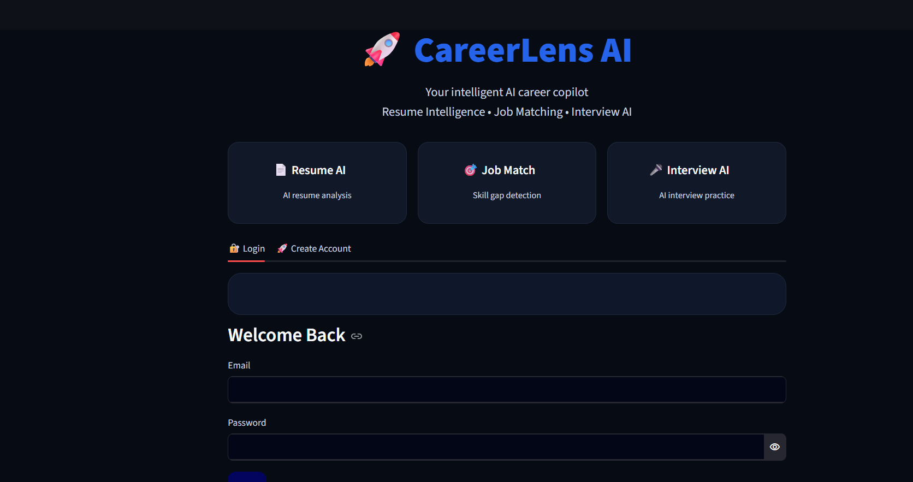
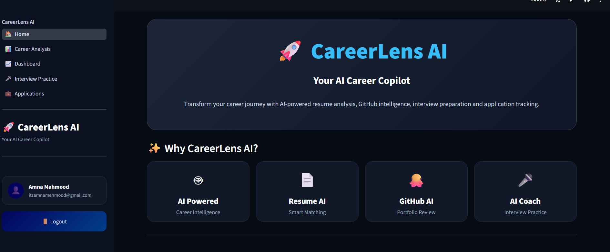
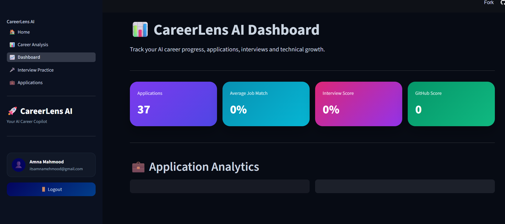
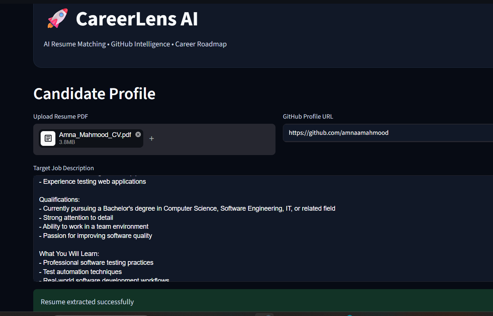
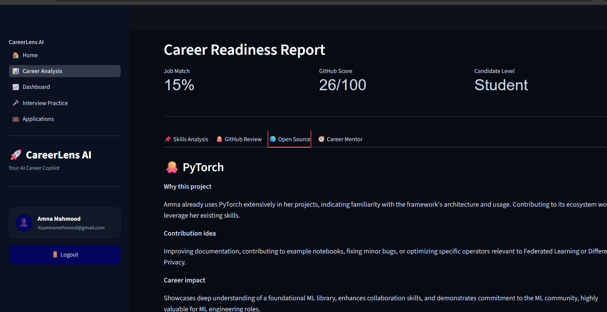
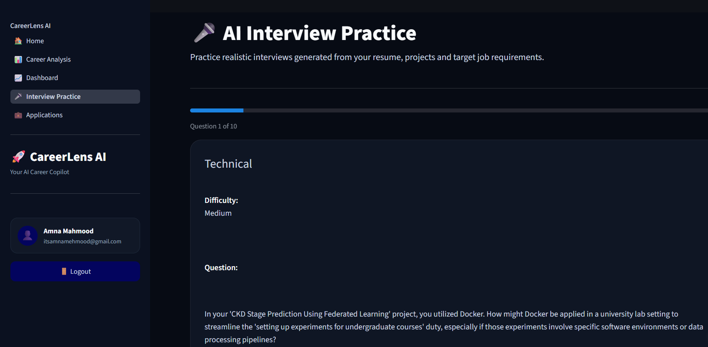
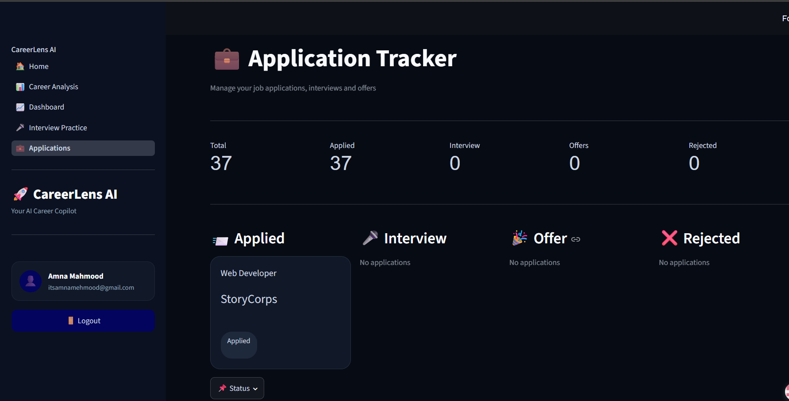
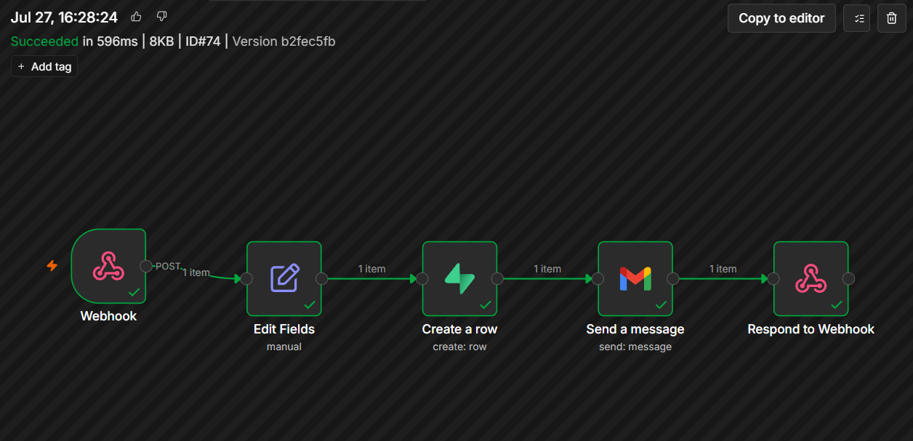
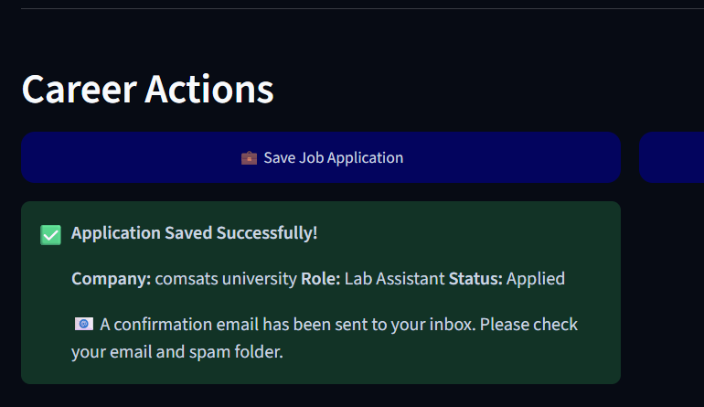
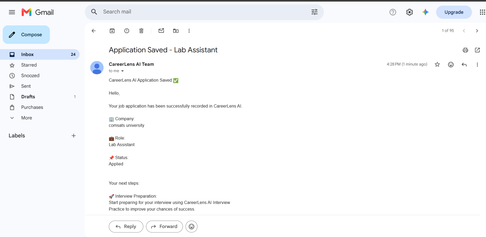

# CareerLens AI

### AI-Powered Career Intelligence Platform for Students & Professionals

<p align="center">
  Analyze your resume, evaluate your GitHub profile, and prepare for interviews — powered by AI.
</p>

<p align="center">
  <a href="#-live-demo">Live Demo</a> •
  <a href="#-features">Features</a> •
  <a href="#-architecture">Architecture</a> •
  <a href="#-installation--setup">Installation</a> •
  <a href="#-tech-stack">Tech Stack</a>
</p>

---

## 🌐 Live Demo

**Application:** [https://your-streamlit-app-url.streamlit.app](https://careerlenz-ai-fyf8beiunwtv44ctckcpbw.streamlit.app/)

---

## 📌 Overview

CareerLens AI is an AI-powered career intelligence platform built to help students and early-career developers understand their career readiness and take concrete steps to improve it.

The platform analyzes resumes against target job descriptions, evaluates GitHub profiles for portfolio strength, and generates personalized, actionable career guidance — combining large language models, structured data analysis, and workflow automation into a single end-to-end tool.

Unlike generic resume checkers, CareerLens AI produces a structured readiness report: a job-match score, a skill-by-skill gap analysis, a GitHub portfolio review, open-source contribution suggestions, and mentor-style career advice — then tracks saved applications and emails a confirmation automatically.

---

## ✨ Features

### 📄 AI Resume Analysis
- Automated resume parsing from PDF
- Technical skill extraction
- Strength and weakness identification
- Career improvement suggestions

### 🎯 Resume-to-Job Matching
- Quantified job match score
- Skill-by-skill compatibility breakdown (strong / partial / missing)
- Missing-technology detection
- Targeted next-step recommendations per skill gap

### 🐙 GitHub Profile Intelligence
- Repository and language analysis
- Project quality evaluation with a numeric GitHub score
- Portfolio strengths and improvement areas
- Curated open-source project recommendations with contribution angles

### 🎤 AI Interview Preparation
- Role-based technical interview questions
- AI-generated feedback on answers
- Interview readiness guidance

### 📋 Application Tracking & Automation
- One-click application logging to a persistent database
- Automated confirmation email on save, via n8n workflow automation

🧠 AI Feature & System Prompt

CareerLens AI's core AI feature is the career readiness analysis engine. It takes a candidate's resume text, a target job description, and (optionally) GitHub activity data, and returns a single structured JSON report — job match score, skill-by-skill gap analysis, GitHub review, open-source recommendations, and a mentor summary.

This is driven by a self-authored system prompt that constrains the model to a fixed output schema, so the Streamlit frontend can reliably render the report into tabs, metrics, and cards:

You are a senior technical career coach and recruiter with 15+ years of
experience hiring software engineers.

Given:
- A candidate's resume text
- A target job description
- (Optional) GitHub profile data: repositories, languages, activity

Analyze the candidate strictly against the target job description and
return ONLY a valid JSON object with this exact structure:

{
  "company_name": string,
  "job_title": string,
  "match_score": number (0-100),
  "candidate_level": "Entry" | "Junior" | "Mid" | "Senior",
  "requirement_analysis": [
    {
      "skill": string,
      "status": "strong_match" | "partial_match" | "no_match",
      "evidence": string,
      "missing": string,
      "next_step": string
    }
  ],
  "github_review": {
    "score": number (0-100),
    "strengths": [string],
    "weaknesses": [string]
  },
  "opensource_recommendations": [
    {
      "project_name": string,
      "why_this_project": string,
      "contribution_type": string,
      "career_impact": string,
      "github_url": string
    }
  ],
  "mentor_summary": string
}

Rules:
- Be honest and specific. Do not inflate the match score.
- Base "evidence" only on what is actually present in the resume/GitHub data.
- If GitHub data is not provided, return a github_review with score 0 and
  an empty strengths/weaknesses array — do not fabricate GitHub information.
- Return raw JSON only. No markdown, no commentary, no code fences.

Google Gemini is the primary model, handling:

Resume comprehension and structured extraction
Skill-gap and job-match scoring against the prompt above
Learning roadmap and mentor-summary generation

Groq is used as a secondary model to run an alternative reasoning pass over the same prompt, cross-checking the primary model's recommendations before they're shown to the user.

Running two models on the same task, rather than one, was a deliberate reliability choice: it reduces the risk of a single model's blind spots shaping the entire report.

## 🏗️ Architecture

```
                              User
                               │
                               ▼
                  Streamlit Cloud Application
                               │
        ┌──────────────────────┼──────────────────────┐
        ▼                      ▼                      ▼
   Gemini AI               Groq AI            Supabase Database
        │                      │                      │
        └──────────────────────┼──────────────────────┘
                               │
                               ▼
                   n8n Automation Platform
                        (Railway Cloud)
                               │
                               ▼
                  Email Notification System
```

---

## ⚡ Automation Workflow

CareerLens AI uses **n8n**, deployed on Railway, to handle post-analysis automation — decoupling notification and persistence logic from the core application. When a user saves a job application, the Streamlit app fires a webhook event that triggers a fully automated database-write-and-notify pipeline.

```
Application Saved (Streamlit)
        │
        ▼
Webhook Trigger (n8n)
        │
        ▼
Supabase — Create Row
        │
        ▼
Gmail — Send Confirmation
        │
        ▼
Respond to Webhook (JSON success)
```

### Workflow Components

**1. Webhook Trigger**

Receives a `POST` request from the CareerLens AI application whenever a user saves a job application.

Responsibilities:
- Exposes a dedicated endpoint (`/new-application`) for the Streamlit backend
- Accepts structured JSON containing company, role, job description, and user identifiers
- Initiates the automation pipeline in real time, with no manual intervention

---

**2. Supabase — Create a Row**

Inserts the incoming application data as a new record in the `applications` table.

Stored fields:

| Field | Description |
|---|---|
| `company` | Company the user applied to |
| `role` | Job title / role applied for |
| `job_description` | Full job description text |
| `status` | Application status (defaults to `Applied`) |
| `user_id` | Identifier for the submitting user |
| `user_email` | Email address for the confirmation notification |

This creates a persistent, queryable application history independent of the Streamlit session.

---

**3. Gmail — Send Confirmation**

Sends an automated confirmation email once the record is successfully saved.

Purpose:
- Confirms the application was recorded successfully
- Summarizes the company, role, and status
- Prompts the user toward the next step — AI-powered interview practice

---

**4. Respond to Webhook**

Returns a JSON success response to the Streamlit application, closing the request loop and confirming the pipeline completed end-to-end.

**Workflow export:** [`automation/careerlens-n8nemail-automation.json`](automation/careerlens-n8nemail-automation.json)

---

## 🛠️ Tech Stack

| Layer | Technology |
|---|---|
| Frontend | Streamlit |
| Backend | Python |
| AI | Google Gemini API, Groq API |
| Database | Supabase (PostgreSQL) |
| Authentication | Supabase Auth |
| Automation | n8n |
| Deployment | Streamlit Cloud, Railway Cloud |

---

## 💻 Installation & Setup

### Prerequisites
- Python 3.10+
- A Supabase project (URL + API key)
- A Google Gemini API key
- A Groq API key
- An n8n instance with the workflow above imported (for email automation)


## 📸 Application Screenshots


**Login**



---


**Home**



---


**Dashboard**



---


**Resume Analysis**





---


**Interview Practice**



---


**Application Tracking**



---


## 🤖 Automation Screenshots

**Workflow Canvas**



---

**Successful Execution**


---

**Confirmation Email**





---

## ☁️ Deployment

**Frontend — Streamlit Cloud**
```
https://careerlenz-ai-fyf8beiunwtv44ctckcpbw.streamlit.app/
```

**Automation — Railway Cloud**
```
https://primary-production-61e9.up.railway.app
```

> **Note:** The Railway Cloud deployment hosts the private n8n automation backend used by CareerLens AI. It is not a user-facing application, therefore opening this URL directly may require n8n authentication. Users interact only with the CareerLens AI Streamlit application, which securely communicates with the n8n workflow through a protected webhook to automate application tracking, database updates, and email notifications.

---

### 🔄 End-to-End System Flow

---

## 📂 Repository Structure

```
CareerLens-AI/
│
├── app.py
├── CareerLens_AI.py
├── auth.py
├── database.py
├── application_manager.py
├── ai_analysis.py
├── github_analyzer.py
├── interview_ai.py
├── interview_manager.py
├── pdf_reader.py
│
├── pages/
│ └── Streamlit application pages
│
├── database/
│ └── Database related modules
│
├── utils/
│ └── Helper utilities
│
├── data/
│ └── Application data files
│
├── assets/
│ ├── dashboard.png
│ ├── resume_analysis.png
│ ├── github_analysis.png
│ ├── interview.png
│ ├── n8n-workflow.png
│ ├── automation_execution.png
│ ├── automation_email.png
│ └── careerlens-n8n-email-automation.json
│
├── requirements.txt
├── .gitignore
└── README.md
```

---

## 🔐 Security

No sensitive information is committed to this repository. The following are excluded via `.gitignore` and managed through environment variables:

- API keys (Gemini, Groq)
- Database credentials (Supabase)
- Authentication secrets
- n8n webhook URLs

---

## 🚀 Roadmap

- **Full web platform** — migrate from Streamlit to a scalable, custom frontend/backend architecture
- **Google Authentication** — connected user accounts with persistent, personalized career profiles
- **AI email intelligence** — secure email integration to automatically detect and organize application updates, interview invitations, and offers
- **Career automation agents** — autonomous tracking of application status, interview reminders, and next-action suggestions

---

## 🤝 Contributing

Contributions are welcome.

1. Fork this repository
2. Create a feature branch
3. Make your changes
4. Submit a pull request

---

## 👩‍💻 Author

**Amna Mahmood**
Computer Science Student — Machine Learning & Applied AI

- GitHub: [github.com/yourusername](https://github.com/amnaamahmood)
- LinkedIn: [linkedin.com/in/yourprofile](https://www.linkedin.com/in/amna-mahmood-835934357/)

---

